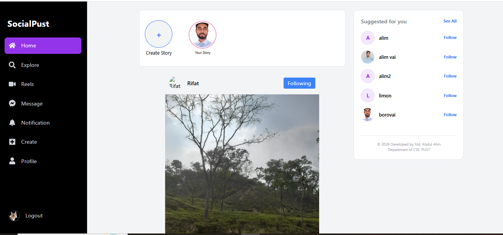
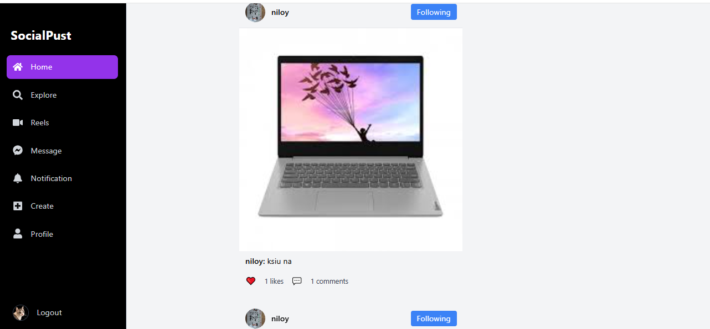
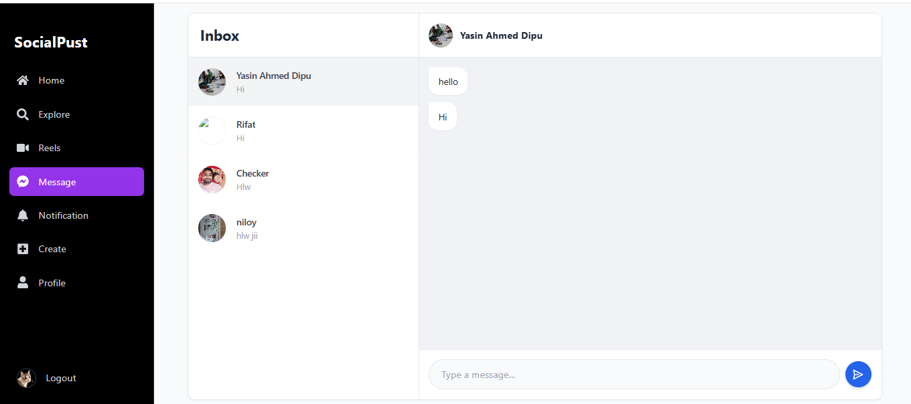
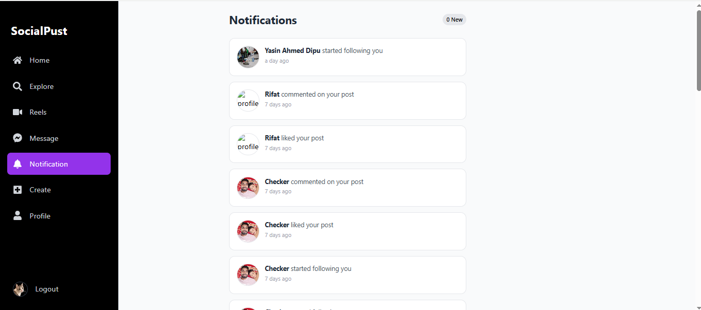
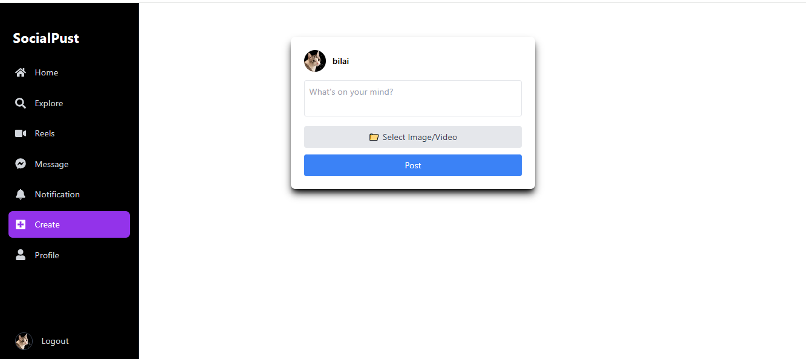
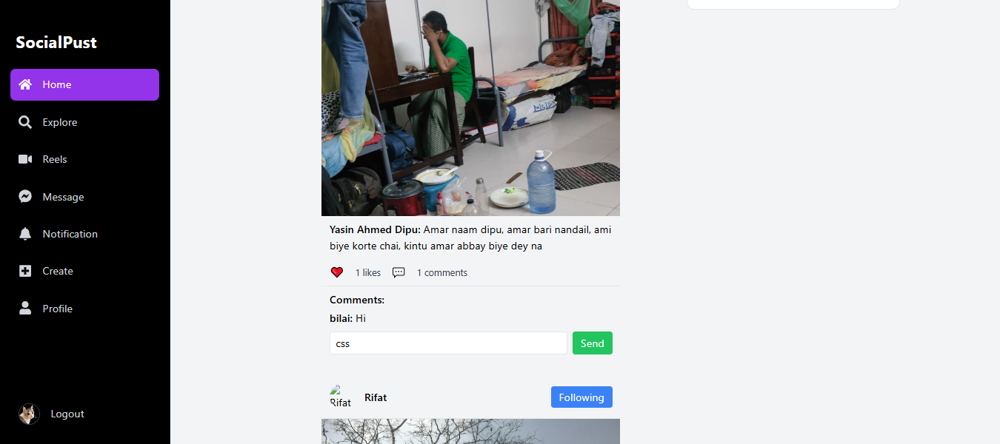
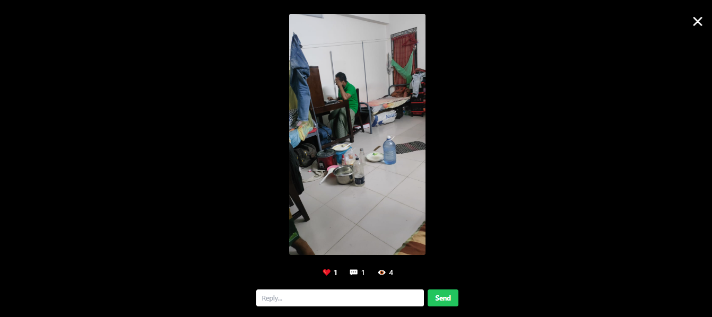
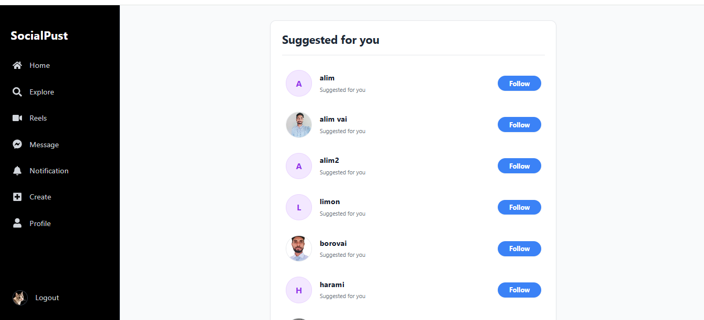

# 🌐 Fullstack Social Media App

📌 Showcase Repository: This repository serves as a showcase for the project. The source code is maintained in separate frontend and backend repositories.

## 🔗 Project Repositories
- 💻 Frontend: [SocialMedia_Frontend](https://github.com/ALIM23700/SocialMedia_Frontend)  
- ⚙ Backend: [SocialMedia_Backend](https://github.com/ALIM23700/SocialMedia_Backend)  

## 🌟 Live Demo
[Click here to view the live app](https://social-media-frontend-sigma-rosy.vercel.app/)

## 🧩 Project Overview
This is a full-stack social media application built with React (frontend) and Node.js + Express (backend).  
It allows users to create accounts, post content, share stories, follow other users, and interact in real-time via chat and notifications.  
The app features a responsive design for desktop and mobile, with a modern UI/UX similar to popular social platforms.

## ⚙️ Tech Stack
- **Frontend:** React, Tailwind CSS  
- **Backend:** Node.js, Express.js  
- **Database:** MongoDB  
- **Authentication:** Firebase Authentication (or your auth method)  
- **Real-time Updates:** Socket.IO / Firebase Realtime DB (for messages, notifications)  
- **Deployment:** Vercel (frontend), Render (backend)

## ✨ Features
- Fully **responsive design** for desktop and mobile  
- **User authentication** (signup/login/logout)  
- **Real-time chat** between users  
- **Stories** to share temporary posts  
- **Posts & Reels** with likes, comments, and sharing  
- **Notifications** for likes, comments, messages, and follows  
- **Explore & Home feed** to discover content  
- **User profile** with editable information  

## 📁 Project Structure
- Frontend code → lives in your [SocialMedia_Frontend](https://github.com/ALIM23700/SocialMedia_Frontend) repo  
- Backend code → lives in your [SocialMedia_Backend](https://github.com/ALIM23700/SocialMedia_Backend) repo  
- This README → provides project overview, features, and repo links  

## ⚙️ Setup Instructions
This repository serves as a showcase for the project. The source code is maintained in separate frontend and backend repositories.
To run the project locally, please check the individual repositories:  

- **Frontend:** [SocialMedia_Frontend](https://github.com/ALIM23700/SocialMedia_Frontend)  
- **Backend:** [SocialMedia_Backend](https://github.com/ALIM23700/SocialMedia_Backend)  

Follow the instructions in each repo to set up and run the project.

## 📸 Screenshots

### Home Feed
  

### Explore & Reels
  

### Chat & Notifications
  

### Post & Create
  

### Stories & Suggestions
  

### User Profile & Auth
  
  

## 🚀 Future Scope
- Edit profile functionality  
- Save & share posts  
- Story highlights  
- Advanced search & explore filters  
- Push notifications  
- Post tagging & mentions  
- Dark mode  
- Analytics/dashboard for user engagement  
